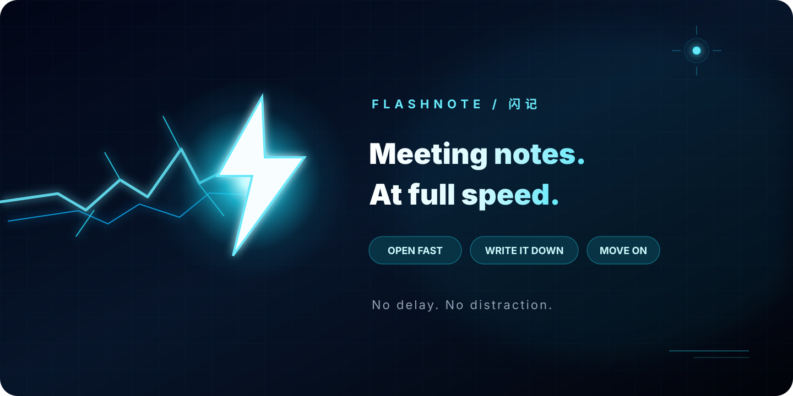

<p align="center">
  <a href="README.md">中文</a> · <strong>English</strong>
</p>

<p align="center">
  
</p>

<h1 align="center">⚡ FlashNote</h1>

<p align="center">
  <strong>Meeting notes at full speed.</strong>
  <br>
  <sub>Open fast. Capture everything. Get out of the way.</sub>
</p>

<p align="center">
  <a href="#why">Why FlashNote</a> ·
  <a href="#download">Download</a> ·
  <a href="#shortcuts">Shortcuts</a> ·
  <a href="#development">Development</a> ·
  <a href="#license">License</a>
</p>

---

Someone says something worth keeping. FlashNote is already open.  
Capture the decision, mark the action item, and close it without leaving the conversation.

> **Open. Capture. Done.**

FlashNote is built for the seconds between hearing something important and losing it. No workspace to arrange, no document format to fight, and no app demanding to stay on screen.

<a id="why"></a>
## ⚡ Why FlashNote

| | |
| --- | --- |
| **Ready immediately** | Launch straight into your recent notes—no setup ritual |
| **Made for Markdown** | Vditor renders as you type, with a clean Typora-like experience |
| **Plain files, your folder** | Every note is a local `.md` file you can keep, move, or edit anywhere |
| **Fast to find** | Press `Ctrl+K` to jump back to any note |
| **Easy to dismiss** | Focus when you need it; close the app when you don't |

Your notes stay visible, portable, and independent of FlashNote.

<a id="download"></a>
## 🚀 Download

### Windows installer

Download **[FlashNote-Setup.exe](release/FlashNote-Setup.exe)** and run it. It installs for your Windows account, so there is no administrator prompt. To upgrade, simply run a newer installer over the existing version.

- Installs to `%LOCALAPPDATA%\Programs\FlashNote\`
- Stores notes in `Documents\闪记` by default; choose a different folder in Settings
- Organizes notes by folder in the sidebar; drag the sidebar edge to resize it
- Uninstall: Windows Settings → Apps → 闪记

Want to skip installation? Download the **[portable FlashNote.exe](release/FlashNote.exe)** instead.

> [!NOTE]
> FlashNote requires Microsoft Edge or the [WebView2 Runtime](https://go.microsoft.com/fwlink/p/?LinkId=2124703).

> [!TIP]
> Upgrading from an older browser-storage version? FlashNote moves those notes into your selected notes folder on first launch.

<a id="shortcuts"></a>
## ⌨️ Shortcuts

### Keep these close

| Key | Action |
| --- | --- |
| `Ctrl+N` | New meeting note |
| `Ctrl+K` | Find and open a note |
| `Ctrl+;` | Insert current time |
| `Ctrl+S` | Save immediately |
| `Ctrl+E` | Export as Markdown |
| `Ctrl+\` | Toggle the sidebar |
| `Ctrl+Shift+F` | Toggle focus mode |

<details>
<summary><strong>All editing shortcuts</strong></summary>

| Key | Action |
| --- | --- |
| `Ctrl+A` | Select all in the current note |
| `Ctrl+B` | Bold |
| `Ctrl+I` | Italic |
| `Ctrl+U` | Underline |
| `Ctrl+1` … `Ctrl+6` | Heading 1–6 |
| `Tab` / `Shift+Tab` | Indent / outdent lists |
| `Ctrl+,` | Settings |
| `Ctrl+Shift+T` | Next theme |

</details>

### Just write Markdown

`# heading` · `- list` · `- [ ] todo` · `> quote` · `**bold**` · `*italic*` · `` `code` `` · `~~strike~~` · `==highlight==`

### Eight ways to set the mood

Daylight · Ink Night · Parchment · Forest · Deep Sea · Sakura · Graphite · High Contrast

<a id="development"></a>
## 🛠 Run it locally

```bash
npm install
npm run dev
```

Then open `http://127.0.0.1:47821`.

The browser preview keeps notes in browser storage and cannot access a notes folder. Use the Windows build when you want real `.md` files on disk.

Build the Windows app from source:

```bash
bash scripts/build-windows.sh
```

<a id="license"></a>
## 📜 License

Released under the [MIT License](LICENSE). Copyright (c) 2026 kimroniny.

---

<p align="center">
  <strong>Keep up with the room.</strong>
  <br>
  <sub>⚡ Open fast. Write it down. Move on.</sub>
</p>
